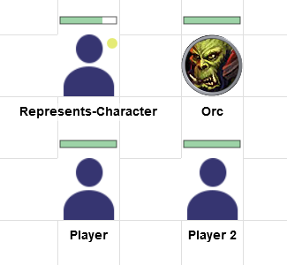
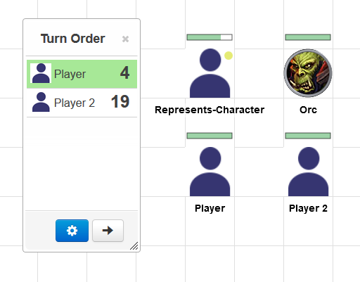
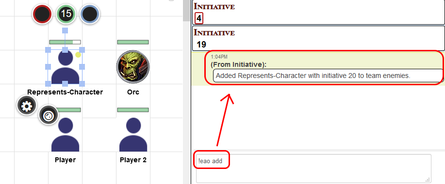
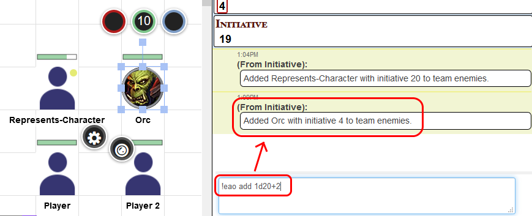
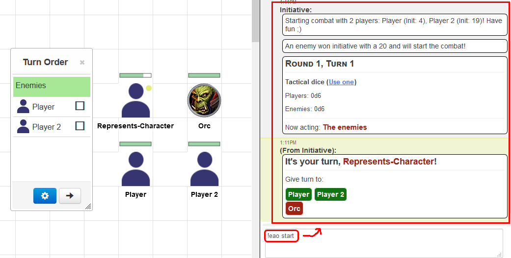
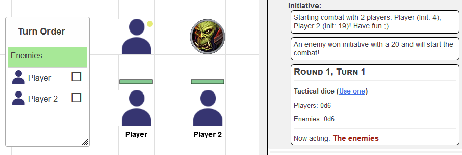
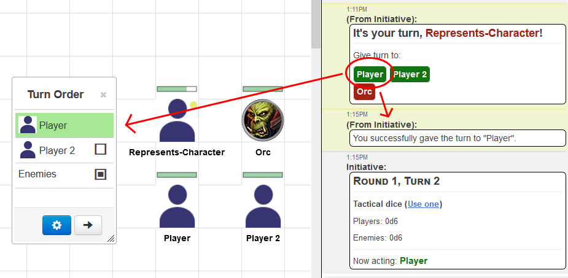
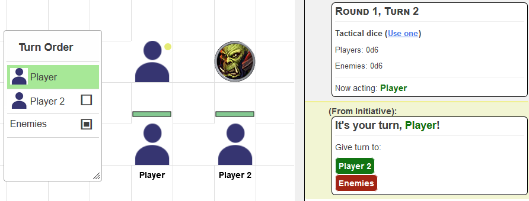
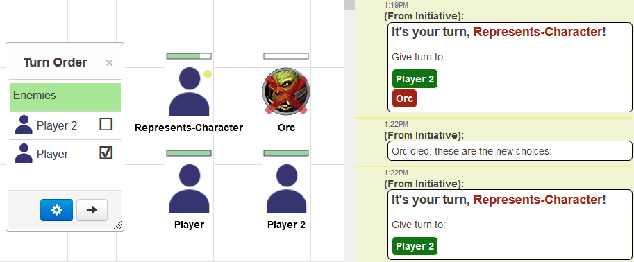
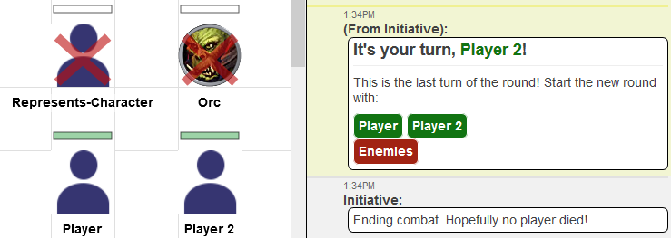

# Elective Action Order

Elective Action Order (shortened to EAO) is an alternative initiative system for Roll20. 

It extends the Roll20 turn order tracker and provides a chat interface for the players and DM.

It is an implementation of "[Elective Action Order](http://www.deadlyfredly.com/2012/02/marvel/)" ([Archive](https://web.archive.org/web/*/http://www.deadlyfredly.com/2012/02/marvel/)) or "[Popcorn Initiative](http://theangrygm.com/popcorn-initiative-a-great-way-to-adjust-dd-and-pathfinder-initiative-with-a-stupid-name/)" ([Archive](https://web.archive.org/web/*/http://theangrygm.com/popcorn-initiative-a-great-way-to-adjust-dd-and-pathfinder-initiative-with-a-stupid-name/)).

Currently, it is only designed to be used with Dungeons & Dragons 5e. Both the "D&D 5E by Roll20" (2014) and the "D&D 2024 by Roll20" character sheets are supported, see [Character sheet compatibility](#character-sheet-compatibility).

## What is "Elective Action Order" / "Popcorn Initiative"?

In summary, it means that the one that has the current turn designates who should get the next turn.

This is in contrast to many static systems, like in standard DnD, where one initiative value is rolled for each participant, the turns are ordered by this initiative value and after that always stay the same.

In EAO, the first turn gets selected by the normal initiative value, but after that, it is not used anymore.

## Installation

See the [installation guide](docs/INSTALL.md).

## Character sheet compatibility

When you add a token without supplying an initiative roll (plain `!eao add`), EAO reads the initiative modifier of the character the token represents and rolls `1d20 + <modifier>`. How that modifier is read depends on the character sheet your game uses:

| **Character sheet** | **How the modifier is read** | **Requirements** |
| ------------------- | ---------------------------- | ---------------- |
| D&D 5E by Roll20 (2014) | The regular `initiative_bonus` attribute | None, works on the "Default" API sandbox |
| D&D 2024 by Roll20 | The `initiative_bonus` computed value via the async `getSheetItem` Mod API | The **"Experimental" API sandbox version** must be selected on the "Mod (API) Scripts" page, and the 2024 sheet must be the game's **primary** character sheet |

If the modifier cannot be read (e.g. 2024 sheet on the "Default" sandbox), EAO warns you and falls back to rolling a plain `1d20`. You can always supply the initiative roll yourself, e.g. `!eao add 1d20+3`.

## Usage

You interact with EAO via the chat inside your game. You can get all the information you need to use EAO with the command `!eao help`. To learn what all the commands do, go to [Commands](#commands).

What follows is a quick demonstration on the basic flow you would follow when using EAO.

Let's say you have a basic setup like this:

"Represents-Character" and "Orc" would be NPCs fighting against the players "Player" and "Player 2".

You can let your players roll initiative like normal, which would look like this:  

You then select the enemy "Represents-Character" and type in chat `!eao add`, which automatically gets the initiative modifier of the character and rolls "1d20 + the modifier":

In this case, the initiative was rolled and "Represents-Character" was added with initiative 20 to the enemy. (You could have used `!eao add p` to add "Represents-Character" to the player team).

Since your enemy token "Orc" does not represent a character, you may want to supply the initiative yourself, so instead of `!eao add` you do `!eao add 1d20+2`:

Now that everyone is in initiative, you can type `!eao start`:

And this is how it would look for one of your players:

You can then give the turn over to your player...

Which shows your player a menu to also give the turn to someone:

As you see, the enemies are grouped into one button, see the [config](#config) for why that is.

Now, if something dies, you can either remove it from initiative by selecting the token and typing `!eao remove`, or, if it is an enemy, simply giving it the "dead"-marker (the big red cross):

Continue this cycle until all enemies are removed, or until you type `!eao stop`, which will stop the combat:

## Config

| **Config property**                      | **Description** | **Default** | **Allowed values** |
| ---------------------------------------- | --------------- | ----------- | ------------------ |
| **showAllMenusToGM**                     | If true, all next turn selection menus for the players will also be shown to the GM. | true | true or false | 
| **groupEnemies**                         | If true, groups enemies together in a single entity instead of allowing players to see all enemies. If you set this to false, since players have to explicitly give the turn over to something, there will be no hidden enemies (i.e. if you have a token on the GM layer, normally it would be hidden in the turnorder. This is not possible with ElectiveActionOrder.) | true | true or false |
| **tacticalDice.enabled**                 | Enables or disables tactical dice. Tactical dice are awarded to the opposite team if the current team chains too many turns together. How tactical dice can be used is up to the DM, generally you can use tactical dice like bardic inspiration. | true | true or false |
| **tacticalDice.persist**                 | If true, saves tactical dice values for the teams between combats. If false, every new combat will reset the tactical dice. | true | true or false |
| **tacticalDice.maxConsecutiveTurns**     | The maximum number of turns a team is allowed to take until tactical dice are awarded to the opposition.  If `tacticalDice.teamSizeAdjustment` is enabled, this is used as the minimum (floor) of the scaled value, so a team can always take at least this many turns no matter how few members it has left. | 2 | positive integers |
| **tacticalDice.teamSizeAdjustment**      | If true, scales the maximum consecutive turns of each team with the size of that team, using `tacticalDice.teamSizeAdjustmentPercent`. Both teams are scaled independently of each other, and `tacticalDice.maxConsecutiveTurns` is used as a floor. Partial turns are rounded in the players' favour: up for the player team, down for the enemy team.  An example with teamSizeAdjustmentPercent at 35 and maxConsecutiveTurns at 2: 8 players and 20 enemies means 3 players (35% of 8 is 2.8, rounded up) or 7 enemies (35% of 20) may act in succession before tactical dice are awarded to the opposition. If the enemies are reduced to 3, they may still take 2 turns in a row (35% of 3 would be 1, but maxConsecutiveTurns is 2).  Without this being enabled, both teams are always limited to maxConsecutiveTurns, no matter how large they are. | true | true or false |
| **tacticalDice.teamSizeAdjustmentPercent** | The percentage of its own members a team may let act in succession before tactical dice are awarded to the opposition. Only used if `tacticalDice.teamSizeAdjustment` is enabled.  The result is rounded up for the player team and down for the enemy team, and never goes below `tacticalDice.maxConsecutiveTurns`. With the default floor of 2 that means this value only starts to matter at 6 players or 9 enemies.  At 35, 9 players may chain 4 turns while 9 enemies may only chain 3, and 20 enemies may chain 7. Lower values make the teams alternate more often. | 35 | whole numbers from 1 to 100 |
| **tacticalDice.die**                     | The value of the tactical dice. | d6 | d4, d20, d100 etc. |
| **tacticalDice.amountIncreasingPerTurn** | If false, the opposite team will get one tactical die for every time it is over the turn limit. With this set to true, however, each turn over the turn limit would give the following amounts to the opposite team: 1, 2, 3, 4, ... | true | true or false |
| **colors.players**                       | The color the player team will have in chat. Don't set it to something light or the contrast will be terrible. | #117412 | something like #158ADF |
| **colors.enemies**                       | The color the enemy team will have in chat. Don't set it to something light or the contrast will be terrible. | #a12313 | something like #158ADF |

## Commands

<> signifies required parameters, [] signifies optional ones.

| **Command**             | **Usage** | **Description** |
| ----------------------- | --------- | --------------- |
| add                     | `!eao add [team] [initiative]`  `[team]`: Can be either "e", "enemies" for the enemy team or "p", "players" for the player team. If the team parameter is missing, the token will be added as player if the token represents a character that can be edited & controlled by a player in this game, or as an enemy otherwise.  `[initiative]`: Can be any valid roll20 dice expression. Must be enclosed in quotes (") if it contains spaces. If the initiative is missing, will attempt to read the initiative modifier of the character the token represents and roll 1d20+<init-modifier>, or fall back to using a single d20. | Adds the tokens that you have currently selected on the board to initiative. |
| add-name                | `!eao add-name <name> [team] [initiative]`  `<name>`: The name that should be added to initiative. Must be enclosed in quotes (") if it contains spaces.  `[team]`: Can be either "e", "enemies" for the enemy team or "p", "players" for the player team. If the team parameter is missing, the token will be added as player if the token represents a character that can be edited & controlled by a player in this game, or as an enemy otherwise.  `[initiative]`: Can be any valid roll20 dice expression. Must be enclosed in quotes (") if it contains spaces. If the initiative is missing, will attempt to read the initiative modifier of the character the token represents and roll 1d20+<init-modifier>, or fall back to using a single d20. | Adds a participant to initiative by name. |
| clear                   | `!eao clear [team]`  `[team]`: Can be either "e", "enemies" for the enemy team, "p", "players" for the player team, or "a", "all" for both teams. If the team parameter is missing, only the enemy team is removed. | Removes participants from initiative without changing anything else - tactical dice, config and everything else stay untouched. Can only be used while no combat is running; to end a running combat use `!eao stop` instead. |
| config                  | `!eao config [property [value]]`  `[property]`: Name of the config property, for example "tacticalDice.enabled". If this and the value are left empty, prints all current config values.  `[value]`: The value for the property. If this is left empty, shows info about the config property and which values are accepted. | Shows the current config values or lets you set them. |
| help                    | `!eao [help]` | Show the help menu. |
| menu                    | `!eao menu` | Shows you the current menu which allows you to choose the next one to give the turn to. Useful if there were many chat lines since the last menu was posted. |
| remove                  | `!eao remove [name]`  `[name]`: The name that should be removed from initiative. Must be enclosed in quotes (") if it contains spaces. If it is empty, will remove the currently selected tokens on the board from initiative. | Removes the selected token or given name. |
| reset-all-data          | `!eao reset-all-data` | Resets the entirety of ElectiveActionOrders data. Everything will be lost, use with caution! |
| reset-config-to-default | `!eao reset-config-to-default` | Resets the config back to default values. |
| start                   | `!eao start` | Starts combat with the previously added participants (using "!eao add" or "!eao add-name"). Will also automatically add any tokens that are currently in the roll20 turn tracker. |
| status                  | `!eao status` | Prints the current status of ElectiveActionOrder. |
| stop                    | `!eao stop` | Stops the combat and removes all participants. |
| tac                     | `!eao tac [use / add / set / clear / limit] [team] [amount]`  `no parameters`: Shows the amount of tactical dice each team has.  `limit`: Shows how many turns in a row each team may currently take before tactical dice are awarded to the opposition, and how many the acting team has taken so far.  `use`: Uses a single tactical die for the given team, or, if the team is empty, for the enemy team.  `add`: Adds the given amount to the given teams tactical dice pool.  `set`: Sets the amount of tactical dice the given team has.  `clear`: Sets the tactical dice of both teams to 0. Everything else (config, participants, consecutive turn tracking) stays untouched.  `[team]`: Can be either "e", "enemies" for the enemy team or "p", "players" for the player team. If the team parameter is missing, the token will be added as player if the token represents a character that can be edited & controlled by a player in this game, or as an enemy otherwise.  `[amount]`: Has to be a positive whole number for &lt;use&gt; and &lt;set&gt;, but can be negative for &lt;add&gt;. | Shows tactical dice status and consecutive turn limits, or uses, adds or sets tactical dice for a team. |

## Problems / Feature requests

If you come across bugs or want something improved or changed, create a new issue here: https://gitlab.com/azzurite/ElectiveActionOrder/issues

## Contributing

Just create a pull request. We will get it in.