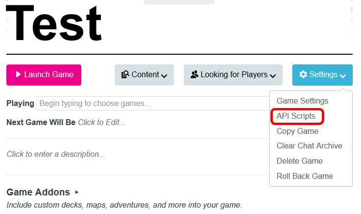
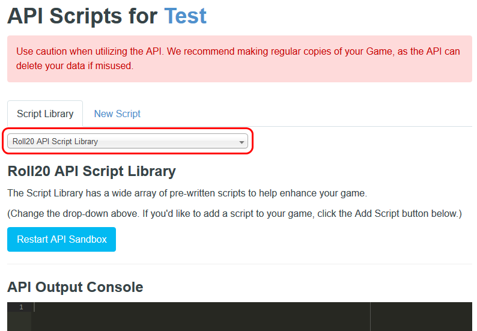
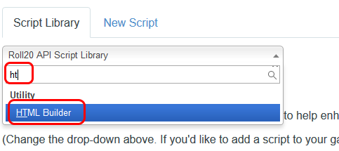
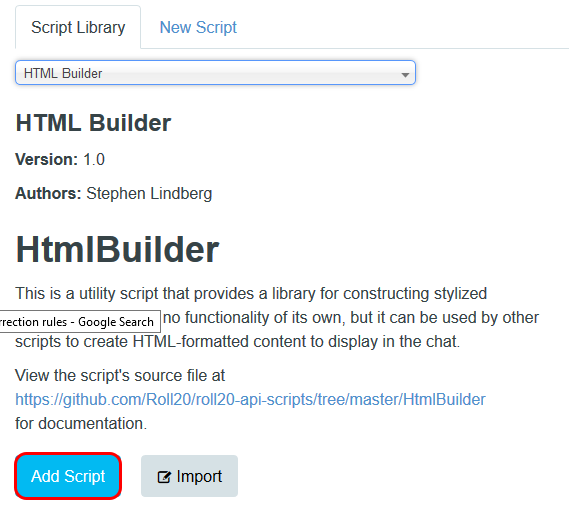
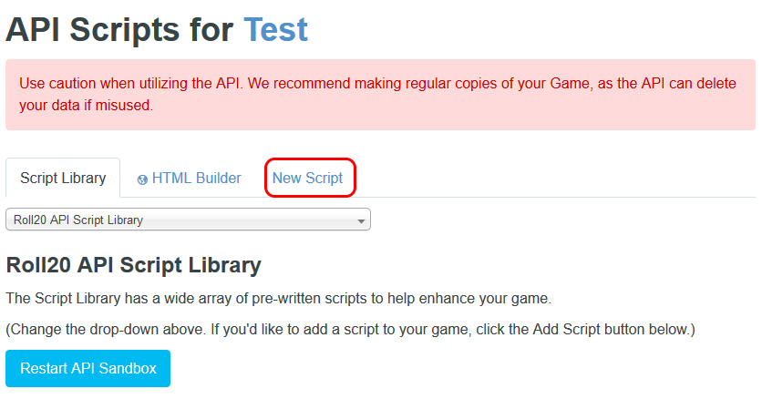
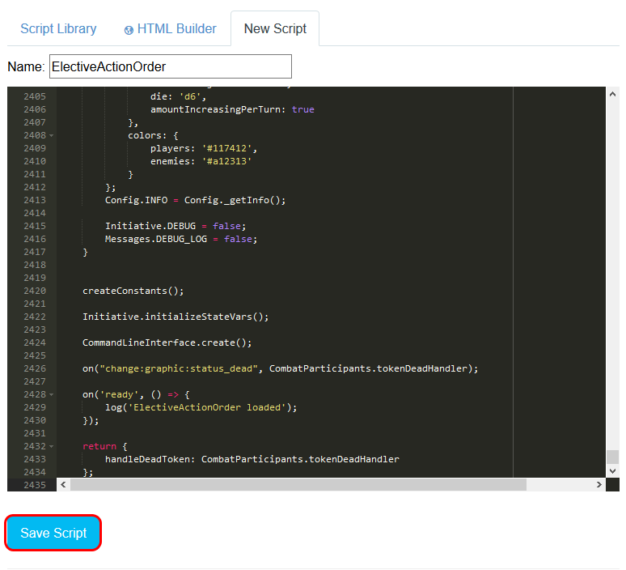

# Installation

> **Note:** Mod (API) scripts are a feature of Roll20 **Pro** subscriptions (or games where the creator has Pro). Roll20 has renamed "API Scripts" to "Mod (API) Scripts", so newer screenshots of the interface may differ from the older images below — the steps are the same.

## Installing the script

1. Open your game's details page (do not launch the game).
2. Click the "Settings" dropdown and select **"Mod (API) Scripts"**
  
3. On the Mod (API) Scripts page, open the script library dropdown ("Mod Library")
  
4. Enter "Ht" in the search, then select **"HtmlBuilder"** (this is a dependency of Elective Action Order)
  
5. Press the "Add Script" button
  
6. Click "New Script" at the top
  
7. Paste everything from [this link](https://gitlab.com/azzurite/ElectiveActionOrder/raw/master/ElectiveActionOrder.js) into the editor, enter an appropriate name (e.g. "ElectiveActionOrder"), and hit the "Save Script" button
  
8. After a few seconds, you should see "ElectiveActionOrder loaded" in the Mod (API) output console at the bottom of the page.

## If you use the "D&D 2024 by Roll20" character sheet

The 2024 sheet is built on Roll20's new Beacon sheet framework, which does not expose regular attributes to Mod scripts. For EAO to be able to read the initiative modifier of your characters, all of the following must be true:

1. **Use the Experimental API sandbox.** On the same "Mod (API) Scripts" page, set the **"API Sandbox Version"** dropdown to **"Experimental"** (instead of "Default") and restart the sandbox. The `getSheetItem` function EAO uses to read Beacon sheet values only exists on the Experimental sandbox.
2. **Make the 2024 sheet the primary sheet of your game.** In your game's main Settings ("Game Settings" page), the "D&D 2024 by Roll20" sheet must be selected as the game's (primary) character sheet. Beacon computed values can only be read from the primary sheet.

If either of these is not the case, EAO still works — it just cannot read the initiative modifier automatically and will fall back to rolling a plain `1d20` (with a warning). You can always supply the initiative roll yourself, e.g. `!eao add 1d20+3`.

If you use the older "D&D 5E by Roll20" (2014) sheet, no extra steps are needed — the "Default" sandbox works fine.
